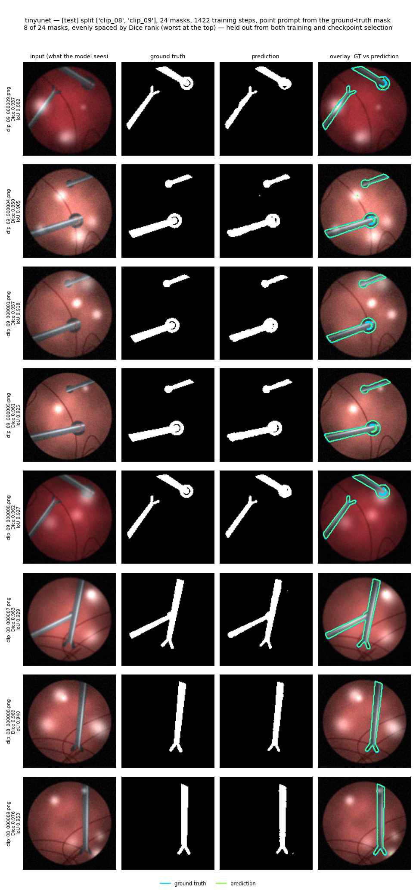

# Pituitary Surgical Segmentation

> Most of this follows my own reading rather than the lab's project, so none of the data or
> progress belonging to that project is here.

To my knowledge, the surgery is done through the nose with an endoscope, so video is the only continuous record of what happened. I built two models over this predictory video:

1. **Instrument segmentation.** Outline the tools, pixel by pixel. That outline is what you need before you can measure how close a tool is to tissue, how economical the movements are, or draw anything over the live view.
2. **Workflow recognition.** For each frame, which step of the operation is happening and which instruments are in view. I believe pituitary surgery in particular suits this well, because there are only a handful of steps, they nearly always come in the same order, and the view is narrow.

The plan is for segmentation to feed workflow. They already share the data format, the split
logic, the seeding, the config loader and the scoring conventions in
[`src/common/`](src/common) and [`src/data/`](src/data).

## Order of read

1. Run the quickstart below, so there is data on disk and you can see something work.
2. Open [`notebooks/segmentation_walkthrough.ipynb`](notebooks). It calls the same functions the real trainer calls.
3. Read [`src/data/phantom.py`](src/data/phantom.py) to see where the frames come from.
4. Read [`src/segmentation/dataset.py`](src/segmentation/dataset.py), then
   [`src/segmentation/train_sam2.py`](src/segmentation/train_sam2.py). That is the whole path
   from a file on disk to a trained model.
5. Do the same on the phase side with
   [`notebooks/phase_walkthrough.ipynb`](notebooks) and [`src/phase/`](src/phase).

## Meanings

Every number here was measured on [`src/data/phantom.py`](src/data/phantom.py), a fake endoscope view I drew from scratch. It is not surgical footage, and nothing here is a clinical result or a benchmark.

I built it so it cannot be solved by accident. The mask is cut from the same shapes used to draw the instruments rather than painted into the pixels, and brightness alone gets you a Dice of only about 0.28, so a model has to learn shape and shading to do well.

**SAM 2 is not installed and has never been run here.**
[`configs/seg_phantom.yaml`](configs/seg_phantom.yaml) trains `TinyUNetSegmenter`, a network of about 30k values, so every score below is a TinyUNet score. The SAM 2 code was written against `facebookresearch/sam2 @ main` and prints `UNVERIFIED PATH` if you run it.

## Results on the phantom, seed 0

10 clips split 6 / 2 / 2 by clip, 1422 training updates, epoch 78 chosen on val:

| 24 masks, 2 held-out test clips | trained | same model untrained |
|---|---|---|
| Dice | **0.959 ± 0.010** | 0.121 ± 0.028 |
| IoU | **0.922 ± 0.018** | 0.065 ± 0.016 |

Both columns were scored after the model was handed a click taken from inside the true mask,
which is the standard way these models are tested. So this measures how well it draws an
outline once you point at the right thing. It says nothing about whether it could find the
instrument on its own. Frames with no instrument are dropped, since there is nothing to
point at.



Phase recognition, 12 videos split 6 / 3 / 3, scored once on 144 held-out frames: step
accuracy 0.340 and macro-F1 0.203, against measured floors of 0.069 and 0.052. Edit score
17.8 against 8.2. The step head lands around four to five times its floor. The
**instrument head, at 0.221 against a floor of 0.123, is the weak part of this run** and
should not be described as working.

Every file in `results/` is explained, with the caveats, in
[`results/README.md`](results/README.md).

## Quickstart

Python 3.10 or newer. Setting `PSAI_FORCE_CPU=1` pins everything to the CPU, which makes two
runs match exactly. Apple's MPS has no way to force that, so use the CPU for anything you
intend to compare.

```bash
pip install -r requirements.txt

python -m src.data.make_dummy_data --out data
PSAI_FORCE_CPU=1 bash scripts/smoke_test.sh
PSAI_FORCE_CPU=1 bash scripts/reproduce_results.sh
PSAI_FORCE_CPU=1 python -m pytest
```
